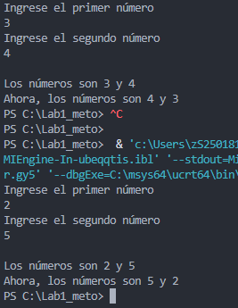

# Ejercicio de laboratorio 3: ejecución de un programa con un error de tiempo de ejecución

## 🛠️ Instrucciones

1. Revisa el programa del archivo denominado lab1ejerc4.cpp.
2. \\**Compilar el programa**\\. No debería obtener errores de sintaxis.
3. \\**Ejecutar el programa**\\. ¿Qué se imprime?
4. Este programa no tiene errores de sintaxis o tiempo de ejecución, pero ciertamente tiene un error lógico. Este error lógico puede no ser fácil de encontrar. La mayoría de los errores lógicos crean un desafío para el programador. \\**Encuentre y corrija el problema.**\\
5. Vuelva a compilar y ejecutar el programa.
6. Ejecutar el programa con valores diferentes. Registre la salida. \\**¿Sientes que estás obteniendo resultados válidos?**\\

## ✅ Resultado

